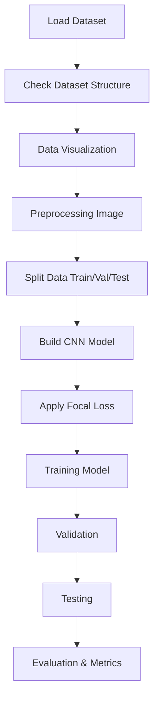

# 🫁 Tuberculosis Detection using CNN (Focal Loss - Tiny Model)

## 📌 Overview
Project ini bertujuan untuk melakukan klasifikasi citra X-ray dada menjadi dua kelas:
- **NORMAL**
- **TUBERCULOSIS**

Model yang digunakan adalah Convolutional Neural Network (CNN) dengan arsitektur ringan (tiny model) serta menggunakan **Focal Loss** untuk menangani ketidakseimbangan data (class imbalance).

---

## 📂 Dataset Structure

Dataset disusun dengan struktur sebagai berikut:

dataset/
│
├── train/
│   ├── NORMAL/
│   └── TUBERCULOSIS/
│
├── val/
│   ├── NORMAL/
│   └── TUBERCULOSIS/
│
└── test/
    ├── NORMAL/
    └── TUBERCULOSIS/

---

## ⚙️ Features

- Data exploration dan visualisasi
- Preprocessing citra (konversi RGB, sampling)
- CNN lightweight architecture
- Implementasi Focal Loss
- Pipeline training, validation, dan testing

---

## 🧠 Model Approach

Pendekatan yang digunakan dalam project ini:

- Convolutional Neural Network (CNN)
- Focal Loss untuk mengatasi class imbalance
- Pembagian data:
  - Train
  - Validation
  - Test

---

## 🚀 How to Run

### 1. Clone Repository
```bash
git clone https://github.com/your-username/your-repo.git
cd your-repo
```

### 2. Install Dependencies
```bash
pip install -r requirements.txt
```

### 3. Set Dataset Path
```bash
dataset_path = "your_dataset_path" 
```

### 4. Run Notebook
```bash
jupyter notebook
```

---

##📊 Data Visualization
Tahapan ini mencakup:

- Menampilkan jumlah data per kelas
- Sampling gambar secara acak
- Visualisasi perbandingan kelas NORMAL dan TUBERCULOSIS

---

##Workflow

---

##🧪 Output

Model menghasilkan:

- Prediksi kelas (NORMAL / TUBERCULOSIS)
- Evaluasi performa model
- Visualisasi hasil prediksi

---

##⚠️ Notes
Pastikan struktur dataset sesuai dengan format yang ditentukan
Path dataset harus valid
Dataset yang tidak seimbang ditangani menggunakan Focal Loss

---

##📈 Future Improvements
- Hyperparameter tuning
- Penggunaan arsitektur model yang lebih kompleks (ResNet, EfficientNet)
- Deployment ke API atau web application
- Implementasi explainability (Grad-CAM)

---

##👨‍💻 Author

Arief

